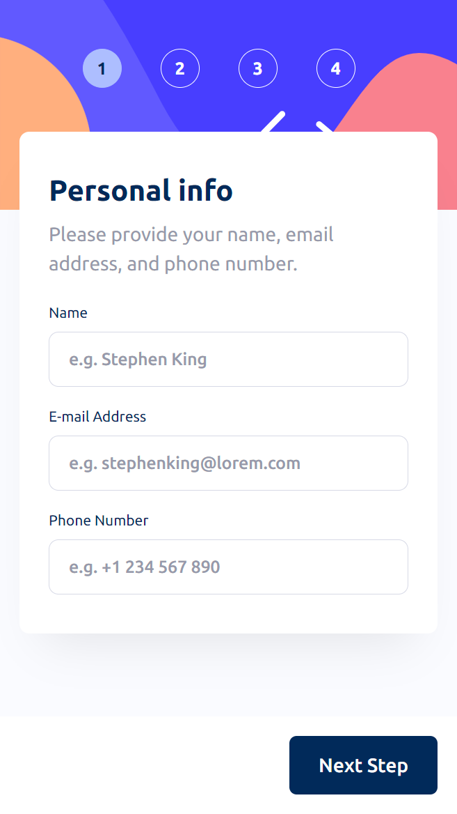
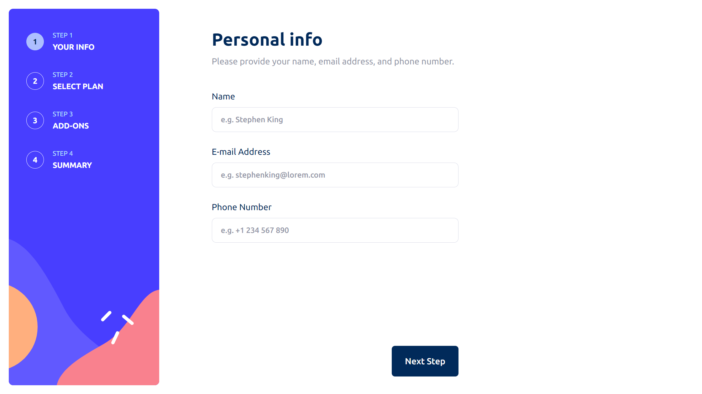

# Frontend Mentor - Multi-step form solution

This is a solution to the [Multi-step form challenge on Frontend Mentor](https://www.frontendmentor.io/challenges/multistep-form-YVAnSdqQBJ). Frontend Mentor challenges help you improve your coding skills by building realistic projects. 

## Table of contents

- [Overview](#overview)
  - [The challenge](#the-challenge)
  - [Screenshot](#screenshot)
  - [Links](#links)
- [My process](#my-process)
  - [Built with](#built-with)
  - [What I learned](#what-i-learned)
- [Author](#author)
- [Acknowledgments](#acknowledgments)

## Overview

### The challenge

Users should be able to:

- Complete each step of the sequence
- Go back to a previous step to update their selections
- See a summary of their selections on the final step and confirm their order
- View the optimal layout for the interface depending on their device's screen size
- See hover and focus states for all interactive elements on the page
- Receive form validation messages if:
  - A field has been missed
  - The email address is not formatted correctly
  - A step is submitted, but no selection has been made

### Screenshot

### Links

- Solution URL: [https://www.frontendmentor.io/solutions/multi-step-form---nextjs-gAUx8ipoN3](https://www.frontendmentor.io/solutions/multi-step-form---nextjs-gAUx8ipoN3)
- Live Site URL: [https://multi-step-form-next-viniciuscosta89s-projects.vercel.app/](https://multi-step-form-next-viniciuscosta89s-projects.vercel.app/)

## My process

### Built with

- Semantic HTML5 markup
- Flexbox
- CSS Grid
- Mobile-first workflow
- [React](https://reactjs.org/) - JS library
- [Next.js](https://nextjs.org/) - React framework
- [TailwindCSS](https://tailwindcss.com/) - A utility-first CSS framework packed with classes
- [shadcn/ui](https://ui.shadcn.com/) - Beautifully designed components
- [Typescript](https://www.typescriptlang.org/) - TypeScript is JavaScript with syntax for types
- [React Hook Form](https://react-hook-form.com/) - Performant, flexible and extensible forms with easy-to-use validation
- [Zod](https://zod.dev/) - TypeScript-first schema validation with static type inference
- [Zustand](https://zustand.docs.pmnd.rs/getting-started/introduction) - A small, fast, and scalable bearbones state management solution
- [Biome](https://biomejs.dev/) - Format, lint, and more in a fraction of a second
- [use-mask-input](https://github.com/eduardoborges/use-mask-input) - A react Hook for build elegant input masks
- [Framer Motion](https://www.framer.com/motion/) - A production-ready motion library for React

### What I learned

This was the perfect project to practice my knowledge of Forms. A combination of React Hook Form and Zod for validation and handling inputs; zustand for the global state; TailwindCSS and shadcn for the UI; Next 14 App router; and Framer Motion for everything on transitions.

## Author

- Website - [Vinicius Costa](https://viniciuscosta.dev/)
- Frontend Mentor - [@viniciuscosta89](https://www.frontendmentor.io/profile/viniciuscosta89)

## Acknowledgments

Most of my knowledge of Zod and RHF came from my job @ Quantum Financial and some coworkers there :D
